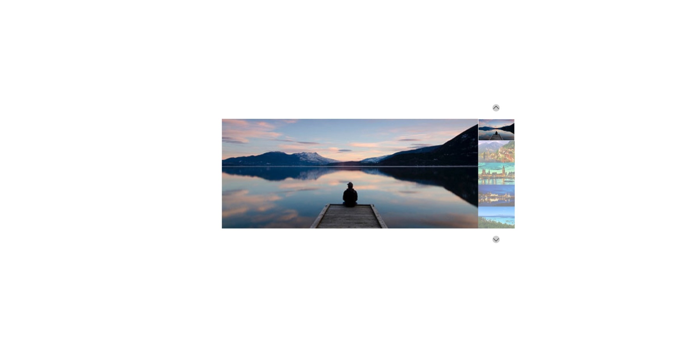

# Carosello News

_HTML+css+js_




Consegna:

Dato un array contenente una lista di cinque immagini, creare un carosello come nello screenshot allegato.

MILESTONE 1

Rimuoviamo tutto il markup statico e inseriamo tutte le immagini dinamicamente servendoci dell'array fornito e un semplice ciclo for che concatena un template literal.
Tutte le immagini saranno nascoste, tranne la prima, che avrà una classe specifica che la renderà visibile.

MILESTONE 2

Al click dell'utente sulle frecce, il programma cambierà l’immagine attiva, che quindi verrà visualizzata al posto della precedente.

BONUS 1:

Aggiungere il ciclo infinito del carosello. Ovvero se è attiva la prima immagine e l'utente clicca la freccia per andare all’immagine precedente, dovrà comparire l’ultima immagine dell’array e viceversa.

BONUS 2:

Aggiungere la visualizzazione di tutte le thumbnails sulla destra dell’immagine grande attiva, come nello screenshot proposto. Tutte le miniature avranno un layer di opacità scura, tranne quella corrispondente all’immagine attiva, che invece avrà un bordo colorato.
Al click delle frecce, oltre al cambio di immagine attiva, gestire il cambio di miniatura attiva.

BONUS 3:

Al click sulla thumbnail, viene visualizzata l'immagine selezionata;

## Indice

- [Scomposizone del problema](#scomposizione-del-problema)
- [Soluzione](#soluzione)

### Scomposizione del problema

1. Creare un array con le stringhe dei nomi delle immagini

2. creare la variabile che si collega all' elemnto HTML che contiene le immagini

3. Creare un ciclo `for` per inserire nell' HTML le immagini (`.innerHTML`) o (`.append`)

4. Creo nel ciclo l' elemento div (a cui dare la classe item) e l' elemento img (a cui dare un `src` in base al suo nome)

5. Inserisco img in item e, succesivamente, item nel contenitore di immagini

6. Cambiare (tramite evento click) la posizione della classe `.active` lungo l' array per far avvenire il cambio di immagine al click

   NB
   raccogliere tutte le immagini in una variabile dopo il ciclo `document.querySelectorAll(".classe");` (tutti gli elementi con .classe)
   prendere entrambe le freccie con variabili nel mio js e farci due eventi diversi (eventListener)
   fare l' operazione opposta per la freccia che porta all' immagine precendente

7. BONUS 1 in entrambi gli eventi andare ad inserire delle condizioni che portino il contatore alla situazione di partenza (diversa a seconda del caso)

8. BONUS 2 usare l emento che racchiude tuttr le immagini per creare la colonna a destra, all' interno degli eventi gestire le classi che determinano il bordo e la non opacità (simile alla classe active).

NB Probabilente alla classe active aggiungo opacità nulla e bordo bianco mentre alla classe item opacità scura

9. BONUS 3 creare eventi click sulle singole thumbnail che resettino il contatore alla loro posizione e che le renda attive

### Soluzione

**_Creare un array con le stringhe dei nomi delle immagini_**

```js
const imagesList = ["01.jpg", "02.jpg", "03.jpg", "04.jpg", "05.jpg"];
```

**_Creare la variabile che si collega all' elemnto HTML che contiene le immagini_**

```html
<div class="items"></div>
```

```js
const imagesContainer = document.querySelector(".items");
```

**_Creare un ciclo `for` per inserire nell' HTML le immagini (`.innerHTML`) o (`.append`)_**

```js
for (let i = 0; i < imagesList.length; i++) {}
```

- creo un ciclo `for` che si ripeterà un numero di volte pari alla lunghezza dell' array immagini

**_Creo nel ciclo l' elemento div (a cui dare la classe item) e l' elemento img (a cui dare un `src` in base al suo nome)_**

```js
const item = document.createElement("div");
item.classList.add("item");
if (i === 0) {
  item.classList.add("active");
}

const img = document.createElement("img");
img.src = `./img/${imagesList[i]}`;
img.alt = `Immagine ${i + 1}`;
```

- creo l' elemnto `div` (`const item = document.createElement("div");`) e ne inserisco la classe `.item` `item.classList.add("item");`

- se è il primo `div` lo rendo active (display block) con la classe `.active` (`  if (i === 0) {item.classList.ad("active");}`)

- creo l' elemento immagine (`const img = document.createElement("img");`)

- assegno all' immagine il suo `src` e `alt` (cambia a seconda del valore di i - scorre lungo l' array) (`img.src =./img/${imagesList[i]}; img.alt = Immagine ${i + 1};`)

**_Inserisco img in item e, succesivamente, item nel contenitore di immagini_**

```js
item.append(img);

imagesContainer.append(item);
```

- inserisco l' elemnto immagine nell' elemento `div` (`  item.append(img);`)

- inserisco il `div` nel contenitore `div.items` (`  imagesContainer.append(item);`)

**_Cambiare (tramite evento click) la posizione della classe `.active` lungo l' array per far avvenire il cambio di immagine al click_**

```js
const prev = document.querySelector(".prev");

const next = document.querySelector(".next");

const images = document.querySelectorAll(".item");

let counter = 0;

next.addEventListener(`click`, function () {
  if (counter < images.length - 1) {
    // rimuovo le classi active
    images[counter].classList.remove("active"); //immagine principale
    counter++;
    // aggiungo le classi active al successivo
    images[counter].classList.add("active"); //immagine principale
  }
});

prev.addEventListener(`click`, function () {
  if (counter > 0) {
    // rimuovo le classi active
    images[counter].classList.remove("active"); //immagine principale
    counter--;
    // aggiungo le classi active al successivo
    images[counter].classList.add("active"); //immagine principale
  }
});
```

- creo un elemento che raccoglie tutti i `div` contenitori delle immagini, simile ad un array (`const images = document.querySelectorAll(".item");`)

- imposto una variabile contatore a 0 (`let counter = 0`)

- creo l' evento click sulla freccia next (`const next = document.querySelector(".next");`)

- faccio avvenire il click se il counter è < di 4 (`counter < images.length - 1`)

- rimuovo la classe active al div corrente, aumento il counter, aggiungo la classe active a quello successivo

- cambio la condizione (`counter > 0`) e diminuisco il counter per l' evento sulla freccia "precedente"

**_BONUS 1 in entrambi gli eventi andare ad inserire delle condizioni che portino il contatore alla situazione di partenza (diversa a seconda del caso)_**

```js
 else if (counter === Number(images.length) - 1) {
    //resetto il contatore immagini se è arrivato all' ultima (ciclo infinito di click)
    images[counter].classList.remove("active");
    imagesAll[counter].classList.remove("thumbnail-active");
    counter = 0;
    images[counter].classList.add("active");
    imagesAll[counter].classList.add("thumbnail-active");
  }

  else if (counter === 0) {
    //riporto al massimo il contatore immagini se è arrivato alla prima(ciclo infinito di click)
    images[counter].classList.remove("active");
    imagesAll[counter].classList.remove("thumbnail-active");
    counter = images.length - 1;
    images[counter].classList.add("active");
    imagesAll[counter].classList.add("thumbnail-active");
  }
```

- per il click su avanti vado a resettare il counter a 0 se arriva all' ultima immagine (`counter === Number(images.length) - 1`)

- per il click su precedente riporto il counter al massimo se è in posizione 0 (`counter === 0`)

**_BONUS 2 usare l emento che racchiude tuttr le immagini per creare la colonna a destra, all' interno degli eventi gestire le classi che determinano il bordo e la non opacità (simile alla classe active)._**

- usando lo stesso ciclo for presente nel punto 3 creo un elemento identico a quello creato per le immagini principali

- col css posiziono l' elemento così creato a destra

- aggiungo agli eventi click anche la classe css che imposta quale thumbnail sia attiva e quale no

**_BONUS 3 creare eventi click sulle singole thumbnail che resettino il contatore alla loro posizione e che le renda attive_**

```js
imagesAll[0].addEventListener(`click`, function () {
  images[0].classList.add("active");
  imagesAll[0].classList.add("thumbnail-active");

  images[1].classList.remove("active");
  imagesAll[1].classList.remove("thumbnail-active");

  images[2].classList.remove("active");
  imagesAll[2].classList.remove("thumbnail-active");

  images[3].classList.remove("active");
  imagesAll[3].classList.remove("thumbnail-active");

  images[4].classList.remove("active");
  imagesAll[4].classList.remove("thumbnail-active");

  counter = 0;
});
```

- per ogni immagine creo un evento click che imposta solo lei come attiva (sia lei che la thumbnail)

- resetto il contatore allo stasso valore della posizione dell' immagine
